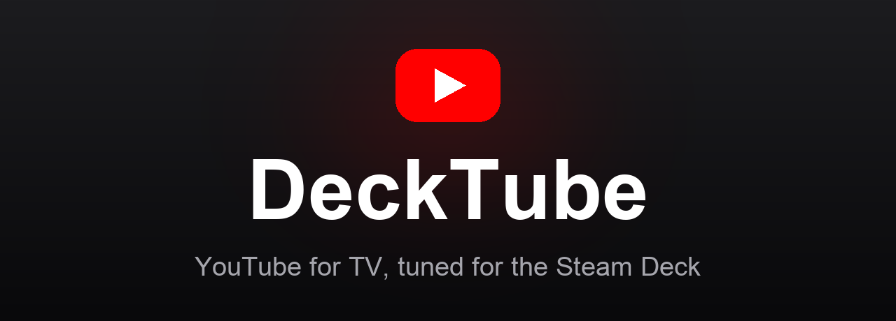
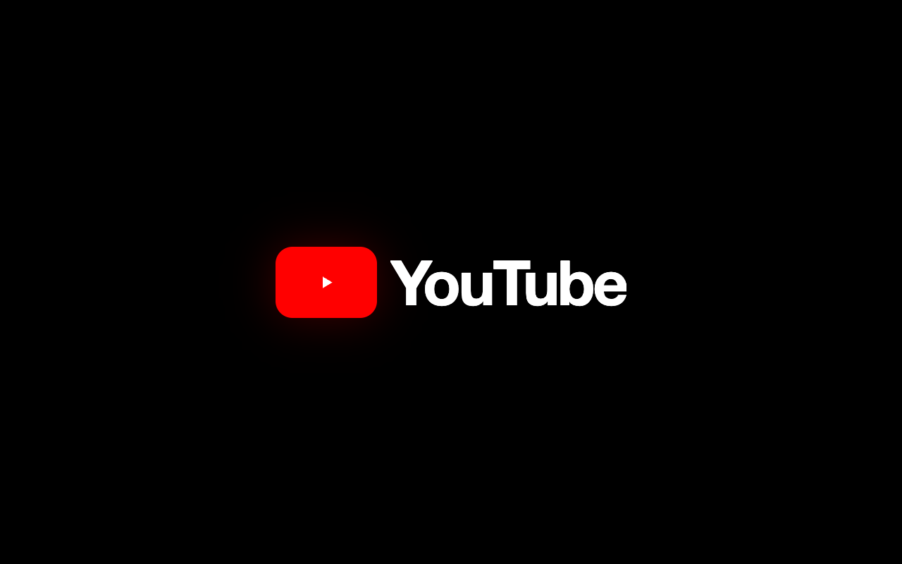
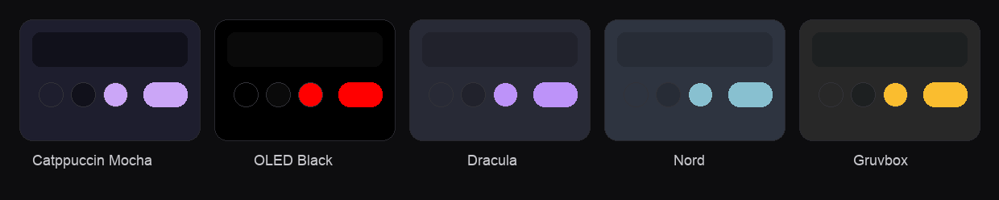

<div align="center">



# DeckTube

YouTube for the living room, tuned for the Steam Deck. The real console TV interface, navigable entirely with the controller, with ads removed and a proper boot animation.


[](https://ko-fi.com/fletcherholt)

**[decktube website](https://fletcherholt.github.io/)** · **[download for Steam Deck](https://github.com/fletcherholt/decktube/releases/latest)**

</div>

## What it is

DeckTube loads YouTube's own TV interface, the one your PlayStation, Xbox and smart TV run, and wraps it in a native app built for a controller. Because it is the real interface and not a copy, every animation, every focus glide and every shelf transition is exactly what you get on a console. DeckTube just makes it run on your Steam Deck, removes the ads, and adds the touches a handheld deserves.

Add it as a non Steam game and the whole thing drives from the stick and d-pad, from the couch, with no keyboard in sight.

DeckTube is a fork of [VacuumTube](https://github.com/shy1132/VacuumTube) by shy. Almost all of the work that makes YouTube's TV interface run on a desktop, the user agent handling, the non DRM playback, the settings framework, the controller support and the original ad blocker, is shy's. This fork adds a Steam Deck layer on top, listed below.

## What this fork adds over VacuumTube

- A **DeckTube entry in the sidebar** that opens a Clean Up panel of toggles for the features people want gone: Shorts (everywhere), the Ask (Gemini) button, end screens, info cards, autoplay, comments, and the "Are you still watching" prompt
- **SponsorBlock with selectable categories** (sponsor, self-promo, interaction, intro, outro, preview, non-music, filler) instead of sponsors only
- **Playback speed** control with an on-screen indicator
- **Preferred / maximum quality** lock, useful for battery and data on the Deck
- **Sleep timer** (stop after a set time, or at the end of the current video)
- **Keep awake** while a video plays, fixing the Steam Deck sleeping mid-video
- Steam Deck first-run defaults: fullscreen and AV1-only codec filtering, keeping hardware decoded VP9, plus GPU compositing flags for smooth interface animations
- A **boot animation** that plays the YouTube logo on launch and hands off to the interface with no blank window
- A set of bundled **colour themes** with a controller-navigable picker (the underlying userstyle injection is shy's)
- **Hardened ad blocking**, adding the `playerAds` and `isInlinePlaybackNoAd` fields on top of shy's existing ad stripping
- A rebrand: name, icon, metadata and packaging

Everything else is VacuumTube.

## Features

- The genuine console TV interface. DeckTube spoofs a TV client so YouTube serves the leanback interface, so the look and the animations are first party, not a reimplementation.
- Full controller navigation. The stick and d-pad move the focus, A selects, B goes back, X searches, R3 opens settings. It feels like a console app because under the hood it is one.
- Ads removed. Video, feed and Shorts ads are stripped out of YouTube's responses before the player ever sees them, the same technique the smart TV ad blockers use. SponsorBlock and DeArrow are built in too.
- A proper boot animation. The YouTube logo assembles on a black screen as the app starts, then fades into the interface. No blank window, no flash.
- Colour themes. Catppuccin Mocha, OLED Black, Dracula, Nord and Gruvbox, chosen from settings with the controller. Themes only change colours, so they never interfere with navigation.
- Tuned for the Deck. On first run it launches fullscreen and filters out AV1, which the Deck cannot decode in hardware, while keeping hardware decoded VP9. GPU compositing flags keep the interface at a steady sixty frames per second.

<div align="center">

</div>

## Download

Grab the latest build for your system from the [releases page](https://github.com/fletcherholt/decktube/releases/latest).

| System | File |
| --- | --- |
| Steam Deck and Linux | `DeckTube-x86_64.AppImage` |
| Windows | `DeckTube-Setup.exe` |
| macOS | `DeckTube-universal.dmg` |

## Steam Deck setup

DeckTube is built to work out of the box on the Deck with full controller control.

1. Switch to Desktop Mode (hold Power, then Switch to Desktop).
2. Download `DeckTube-x86_64.AppImage` from the releases page into a folder that survives system updates, such as `~/Applications`, and make it executable.
3. In Steam, choose Add a Non Steam Game and point it at the AppImage.
4. Switch back to Gaming Mode. Launch DeckTube from your library.
5. Optional, in DeckTube's Properties set the controller layout to Gamepad so the stick and d-pad map cleanly to the interface.

The app launches fullscreen, plays its boot animation and drops you straight into YouTube, all navigable with the controller.

## Themes

DeckTube ships with a set of colour themes, picked from the Theme tab in settings. They restyle the interface without touching the layout, so navigation is never affected.

<div align="center">

</div>

## Controls

| Input | Action |
| --- | --- |
| D-pad or left stick | Move the focus |
| A | Select or confirm |
| B | Back |
| X | Search |
| R3 (press right stick) | Open DeckTube settings |
| Triggers | Seek backwards and forwards |
| Bumpers | Back and forward |
| `[` and `]` (keyboard) | Slower and faster playback speed (`\` resets) |

Open settings any time with R3 on the controller, or Ctrl and O on a keyboard. Every setting in the overlay is reachable with the controller.

## Ad blocking

DeckTube does not use a network blocker or a browser extension, because neither can reliably remove YouTube's in stream video ads on the TV interface. Instead it intercepts YouTube's own data as it is parsed and strips the ad fields out before the player sees them, the approach proven by the smart TV ad blockers. This sits below the level YouTube's anti adblock measures operate at, so it is stable and low maintenance.

Server side ad injection, where ads are stitched into the video stream itself, is the one thing this cannot remove. It is still in limited testing at YouTube and is not a problem today.

## Building from source

```bash
npm install
npm start                  # run it
npm run linux:build        # Linux AppImage, deb and tarball
npm run windows:build      # Windows installer and portable
npm run mac:build          # macOS dmg
```

Releases are built automatically by GitHub Actions for all three platforms when a release is published.

## How it works

DeckTube loads `youtube.com/tv` in an Electron window with a PlayStation class Cobalt user agent, which is what unlocks the TV interface. It deliberately reports an older Cobalt version to the page so YouTube serves clear, non DRM streams that Electron can play. A set of preload modules then run inside the interface to add the ad blocker, SponsorBlock, the themes, the settings overlay and the controller bindings. The boot splash is a separate window shown over the top until the interface is ready, then faded out for a clean hand off.

## Support

If DeckTube is useful to you, you can support its development on [Ko-fi](https://ko-fi.com/fletcherholt). It is entirely optional and always appreciated.

## Credits

- DeckTube is a fork and rebuild by Fletcher Holt of [VacuumTube](https://github.com/shy1132/VacuumTube) by shy, used under the MIT licence. Most of the heavy lifting that makes the TV interface work on a desktop is shy's work.
- The ad blocking and theming techniques draw on [TizenTube](https://github.com/reisxd/TizenTube) and the leanback userstyle community.
- SponsorBlock and DeArrow data come from [sponsor.ajay.app](https://sponsor.ajay.app).
- Catppuccin palette by [catppuccin](https://github.com/catppuccin/catppuccin).

## Licence

MIT. See [LICENSE](LICENSE). DeckTube is not affiliated with or endorsed by YouTube or Google.
